# Laboratorio 4.1: Plataforma HA, Balanceo de Carga y Monitoreo

<div align="center">

**Universidad San Francisco Xavier de Chuquisaca**  
Facultad de Tecnología  
Carrera de Ingeniería de Sistemas

---

| | |
|---|---|
| **Asignatura** | Infraestructura, Plataformas Tecnológicas y Redes (SIS313) |
| **Docente** | Ing. Marcelo Quispe Ortega |
| **Semestre** | 1/2026 — 5to Semestre |
| **Fecha** | Mayo 2026 |
| **URL App** | https://vlan102-app.rootcode.com.bo |
| **URL Grafana** | https://vlan102-monitoring.rootcode.com.bo |

</div>

---

## 👥 Integrantes del Grupo 2

| # | Nombre Completo | Rol | VM | IP VLAN |
|---|---|---|---|---|
| 1 | **Quispe Sullca Luis Fernando** | Proxy + Monitoreo | server-155 | `192.168.102.2` |
| 2 | **Calatayud Mamani Alex Josue** | Aplicación 1 | server-156 | `192.168.102.3` |
| 3 | **Quispe Anagua Jhon Christian** | Aplicación 2 | server-157 | `192.168.102.4` |
| 4 | **Chambi Condori Janet** | Base de Datos | server-158 | `192.168.102.5` |

---

## Índice

1. [Introducción](#1-introducción)
2. [Objetivos](#2-objetivos)
3. [Arquitectura del Sistema](#3-arquitectura-del-sistema)
4. [Configuración de Red — VLANs](#4-configuración-de-red--vlans)
5. [VM Proxy — Nginx + Monitoreo](#5-vm-proxy--nginx--monitoreo)
6. [VM Aplicación 1 — Node.js + PM2](#6-vm-aplicación-1--nodejs--pm2)
7. [VM Aplicación 2 — Node.js + PM2](#7-vm-aplicación-2--nodejs--pm2)
8. [VM Base de Datos — MariaDB](#8-vm-base-de-datos--mariadb)
9. [Monitoreo — Prometheus + Grafana](#9-monitoreo--prometheus--grafana)
10. [Verificación del Balanceo de Carga](#10-verificación-del-balanceo-de-carga)
11. [Análisis de Resultados](#11-análisis-de-resultados)
12. [Conclusiones](#12-conclusiones)
13. [Anexos](#13-anexos)

---

## 1. Introducción

La **Alta Disponibilidad (HA)** es un principio de diseño de sistemas que garantiza que un servicio permanezca operativo durante el mayor tiempo posible, minimizando el tiempo de inactividad. En infraestructuras web modernas, esto se logra distribuyendo la carga entre múltiples servidores y disponiendo de mecanismos automáticos de recuperación ante fallos.

Este laboratorio implementa una arquitectura HA completa con cuatro componentes clave:

- **Proxy Inverso con Balanceo de Carga (Nginx):** Actúa como punto de entrada único, distribuyendo las solicitudes HTTP entre múltiples instancias de la aplicación. Si una instancia falla, Nginx redirige automáticamente el tráfico a las instancias disponibles.

- **Servidores de Aplicación (Node.js + PM2):** Dos instancias independientes de una API RESTful que sirven las mismas funcionalidades. PM2 gestiona los procesos en modo producción, garantizando que la aplicación se reinicie automáticamente si falla.

- **Base de Datos Centralizada (MariaDB):** Un único servidor de base de datos compartido por ambas instancias de aplicación, con acceso restringido solo desde las IPs autorizadas.

- **Sistema de Monitoreo (Prometheus + Grafana):** Recolecta métricas de rendimiento de todas las VMs en tiempo real y las visualiza en dashboards interactivos.

La arquitectura fue desplegada en el Centro de Datos de la universidad utilizando VMs reales, con segregación de red mediante **VLANs** (Virtual Local Area Networks) asignadas específicamente al Grupo 2 (VLAN ID: 102, subred: `192.168.102.0/29`).

---

## 2. Objetivos

### Objetivo General

Implementar una arquitectura web de Alta Disponibilidad (HA) con balanceo de carga, segregación de servicios mediante VLANs y monitoreo integral de rendimiento, demostrando el failover automático ante la caída de una instancia.

### Objetivos Específicos

- Configurar un Proxy Inverso con Nginx para balancear el tráfico HTTP entre dos instancias Node.js.
- Desplegar dos instancias de la aplicación `api-restful-crud-movies` gestionadas por PM2 en modo producción.
- Instalar y asegurar una base de datos MariaDB centralizada con acceso restringido por IP.
- Integrar Prometheus y Grafana para monitorear CPU, memoria, disco y red de las 4 VMs.
- Configurar VLANs para segregar el tráfico de red del Grupo 2 del resto de grupos.
- Demostrar el failover automático al detener una instancia de aplicación.

---

## 3. Arquitectura del Sistema

### 3.1 Diagrama de Arquitectura

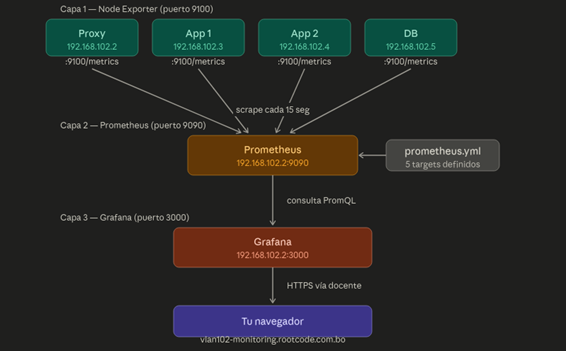

*El diagrama muestra las 3 capas: Node Exporter (puerto 9100) en todas las VMs, Prometheus (puerto 9090) recolectando métricas, y Grafana (puerto 3000) visualizándolas. El acceso público se realiza vía HTTPS a través del servidor del docente.*

### 3.2 Tabla de Infraestructura

| Rol | Hostname | IP Real | IP VLAN 102 | Puerto |
|---|---|---|---|---|
| Gateway (Docente) | — | — | `192.168.102.1` | — |
| Proxy + Monitoreo | server-155 | `192.168.100.155` | `192.168.102.2` | 80, 9090, 3000 |
| Aplicación 1 | server-156 | `192.168.100.156` | `192.168.102.3` | 3000, 9100 |
| Aplicación 2 | server-157 | `192.168.100.157` | `192.168.102.4` | 3000, 9100 |
| Base de Datos | server-158 | `192.168.100.158` | `192.168.102.5` | 3306, 9100 |

### 3.3 Flujo de una Solicitud HTTP

```
Usuario (Internet)
        │
        │ HTTPS
        ▼
https://vlan102-app.rootcode.com.bo
(Servidor del Docente — enruta a 192.168.102.2:80)
        │
        │ HTTP
        ▼
[VM Proxy — Nginx — 192.168.102.2:80]
        │ Round Robin (balanceo)
        ├──────────────────────┐
        ▼                      ▼
[VM App1 — Node.js     [VM App2 — Node.js
 192.168.102.3:3000]    192.168.102.4:3000]
        │                      │
        └──────────┬───────────┘
                   ▼
        [VM DB — MariaDB
         192.168.102.5:3306]
```

---

## 4. Configuración de Red — VLANs

### 4.1 ¿Qué es una VLAN?

Una **VLAN (Virtual LAN)** permite segmentar lógicamente una red física en múltiples redes virtuales independientes. En este laboratorio, cada grupo recibió una VLAN única para aislar su tráfico del resto:

- **Grupo 2 → VLAN ID: 102 → Subred: 192.168.102.0/29**

La subred `/29` proporciona exactamente **6 IPs de host** (192.168.102.1 a .6), suficientes para el gateway y las 4 VMs.

### 4.2 Configuración Netplan con VLAN

La estrategia fue **conservar la IP original** (para mantener acceso SSH) y **agregar la VLAN encima** como interfaz virtual. Esto se hizo en las 4 VMs.

#### Estructura del archivo Netplan (ejemplo VM Proxy):

```yaml
network:
  version: 2
  ethernets:
    ens18:
      addresses:
        - "192.168.100.155/24"    # IP original — NO eliminar (mantiene SSH)
      nameservers:
        addresses:
          - 8.8.8.8
        search: []
      routes:
        - to: "default"
          via: "192.168.100.1"
  vlans:
    vlan102:                       # Interfaz VLAN virtual
      id: 102                      # VLAN ID del Grupo 2
      link: ens18                  # Enlazada a la interfaz física
      addresses:
        - "192.168.102.2/29"       # IP en la subred del laboratorio
```

> 💡 **Nota:** La interfaz `vlan102` se crea automáticamente sobre `ens18`. El tráfico etiquetado con VLAN ID 102 circula por la misma interfaz física pero lógicamente aislado.

---

## 5. VM Proxy — Nginx + Monitoreo

**Responsable:** Quispe Sullca Luis Fernando  
**IP:** `192.168.100.155` / `192.168.102.2`

### 5.1 Verificación de Interfaces de Red

```bash
ip addr
```

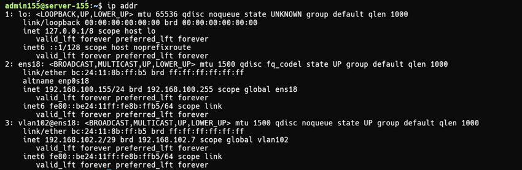

La VM Proxy tiene dos IPs activas:
- `ens18`: `192.168.100.155/24` — acceso SSH y administración
- `vlan102@ens18`: `192.168.102.2/29` — red del laboratorio

### 5.2 Configuración del Netplan

```bash
sudo nano /etc/netplan/50-cloud-init.yaml
```

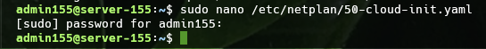

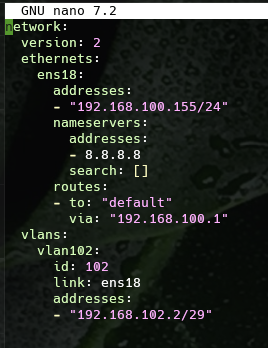

```bash
sudo netplan apply
```

### 5.3 Instalación de Nginx

```bash
sudo apt update && sudo apt install nginx -y
```

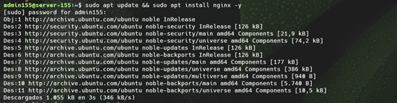

### 5.4 Configuración del Balanceador de Carga

```bash
sudo nano /etc/nginx/sites-available/default
```

**Configuración del upstream (balanceador):**

```nginx
upstream loadbalancer {
    server 192.168.102.3:3000;   # App 1
    server 192.168.102.4:3000;   # App 2
}

server {
    listen 80;
    server_name _;

    location / {
        proxy_pass http://loadbalancer;
        proxy_set_header Host $host;
        proxy_set_header X-Real-IP $remote_addr;
        proxy_set_header X-Forwarded-For $proxy_add_x_forwarded_for;
    }
}
```

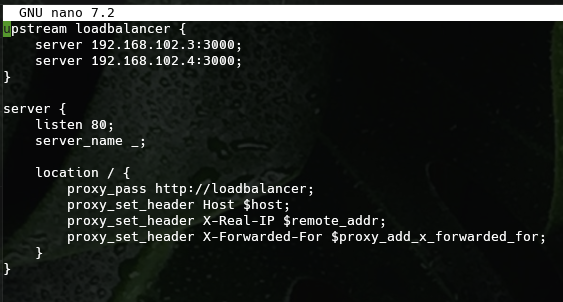

> 💡 **¿Qué es un upstream?** Es un bloque de Nginx que define un grupo de servidores backend. El algoritmo **Round Robin** (predeterminado) distribuye las solicitudes de forma secuencial: solicitud 1 → App1, solicitud 2 → App2, solicitud 3 → App1, y así sucesivamente.

### 5.5 Verificación y Reinicio de Nginx

```bash
sudo nginx -t
sudo systemctl restart nginx
sudo systemctl status nginx
```

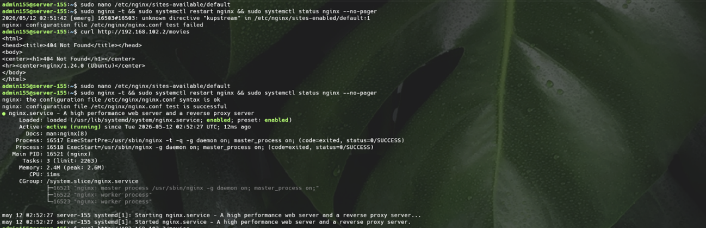

### 5.6 Instalación de Prometheus y Grafana

**Instalar Prometheus y Node Exporter:**

```bash
sudo apt install prometheus prometheus-node-exporter -y
```

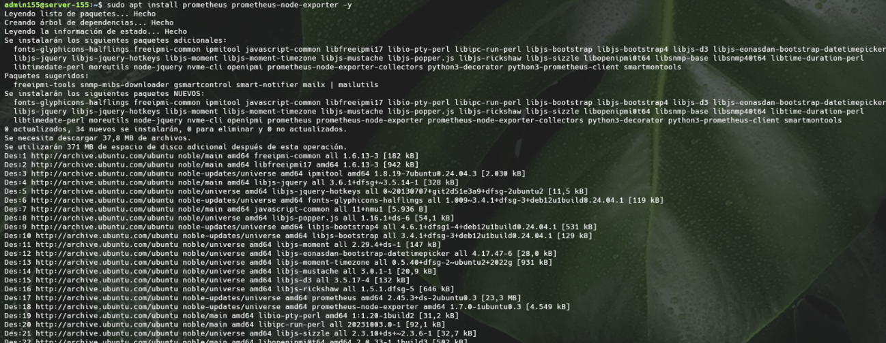

**Instalar Grafana:**

```bash
sudo apt-get install -y apt-transport-https software-properties-common wget
sudo mkdir -p /etc/apt/keyrings/
wget -q -O - https://apt.grafana.com/gpg.key | gpg --dearmor | sudo tee /etc/apt/keyrings/grafana.gpg > /dev/null
echo "deb [signed-by=/etc/apt/keyrings/grafana.gpg] https://apt.grafana.com stable main" | sudo tee -a /etc/apt/sources.list.d/grafana.list
sudo apt update
sudo apt install grafana -y
sudo systemctl daemon-reload
sudo systemctl enable grafana-server
sudo systemctl start grafana-server
```

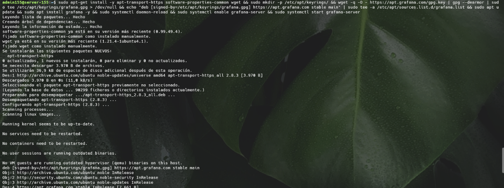

**Verificar ambos servicios activos:**

```bash
systemctl status prometheus --no-pager && systemctl status grafana-server --no-pager
```

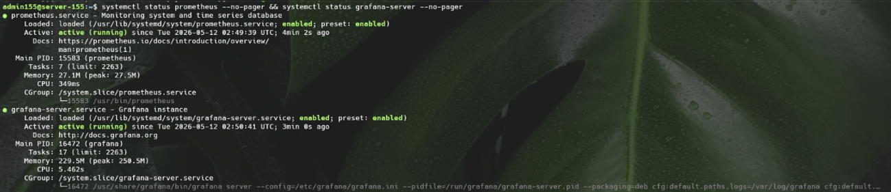

### 5.7 Configuración de Prometheus

```bash
sudo nano /etc/prometheus/prometheus.yml
```

**Configuración de los targets (todas las VMs):**

```yaml
scrape_configs:
  - job_name: 'prometheus'
    static_configs:
      - targets: ['localhost:9090']

  - job_name: 'node-proxy'
    static_configs:
      - targets: ['192.168.102.2:9100']

  - job_name: 'node-app1'
    static_configs:
      - targets: ['192.168.102.3:9100']

  - job_name: 'node-app2'
    static_configs:
      - targets: ['192.168.102.4:9100']

  - job_name: 'node-db'
    static_configs:
      - targets: ['192.168.102.5:9100']
```

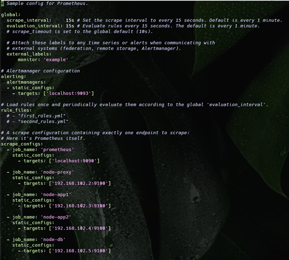

```bash
sudo systemctl restart prometheus
```

---

## 6. VM Aplicación 1 — Node.js + PM2

**Responsable:** Calatayud Mamani Alex Josue  
**IP:** `192.168.100.156` / `192.168.102.3`

### 6.1 Verificación de Interfaces de Red

```bash
ip addr
```

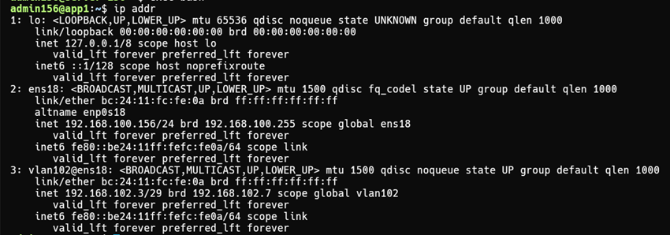

### 6.2 Configuración del Netplan

```bash
sudo nano /etc/netplan/50-cloud-init.yaml
```

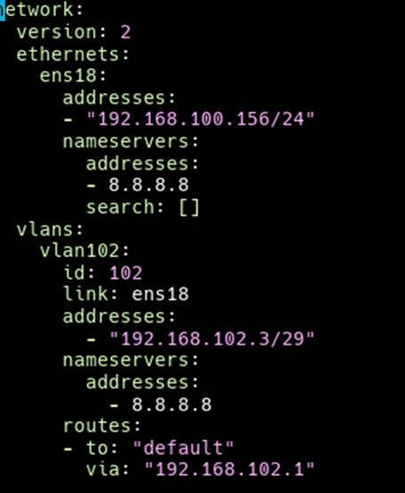

```bash
sudo netplan apply
```

### 6.3 Instalación de Node.js con NVM

NVM (Node Version Manager) permite instalar y gestionar múltiples versiones de Node.js de forma independiente del sistema operativo.

```bash
# Descargar e instalar NVM
curl -o- https://raw.githubusercontent.com/nvm-sh/nvm/v0.40.3/install.sh | bash

# Cargar NVM sin reiniciar la shell
\. "$HOME/.nvm/nvm.sh"

# Instalar Node.js versión 22
nvm install 22

# Verificar versiones
node -v    # v22.22.2
npm -v     # 10.9.7
```

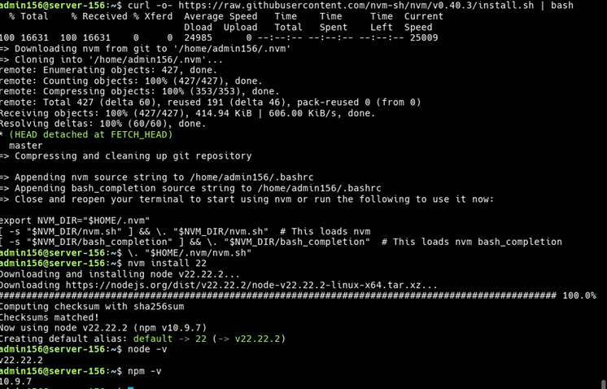

### 6.4 Instalación de PM2

**PM2** es un gestor de procesos para Node.js orientado a producción. Mantiene la aplicación activa 24/7, la reinicia si falla, y gestiona los logs automáticamente.

```bash
npm install pm2@latest -g
pm2 --version
```

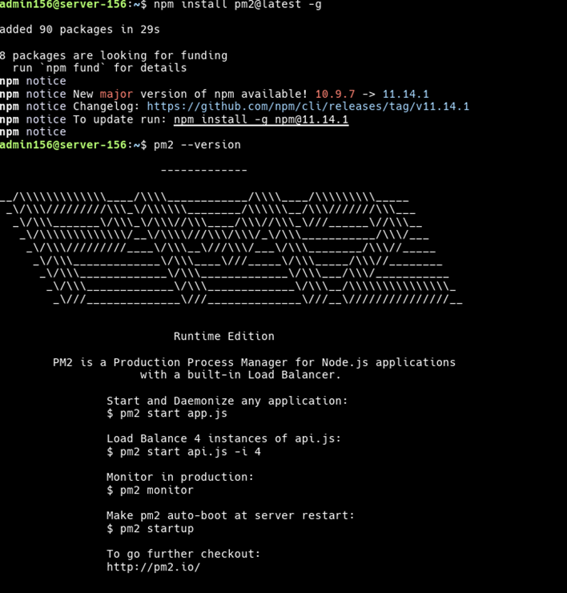

### 6.5 Clonar la Aplicación

```bash
mkdir ~/apps && cd ~/apps
git clone https://github.com/marceloquispeortega/api-restful-crud-movies app1
cd ~/apps/app1 && npm install
```

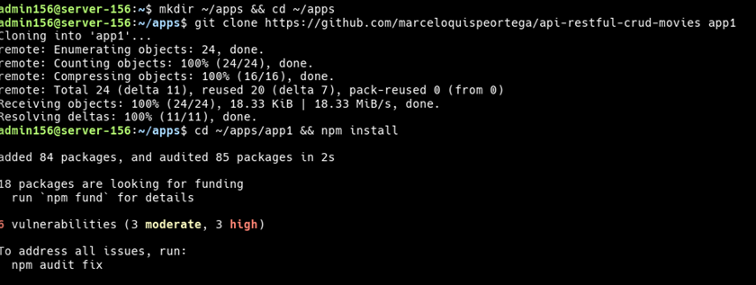

### 6.6 Configurar Variables de Entorno

```bash
cp ~/apps/app1/.env.example ~/apps/app1/.env
nano ~/apps/app1/.env
```

**Contenido del archivo `.env`:**

```env
PORT=3000
DB_HOST=192.168.102.5
DB_PORT=3306
DB_NAME=db_movies
DB_USER=usr_movies
DB_PASSWORD=secret
```

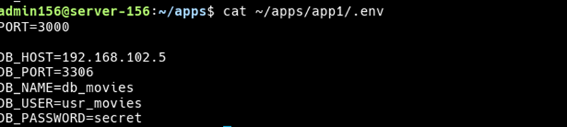

### 6.7 Lanzar con PM2

```bash
cd ~/apps/app1 && pm2 start app.js --name app1
pm2 status
```

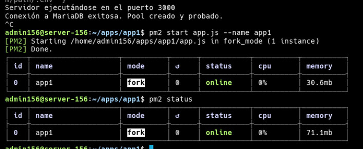

**Configurar auto-arranque al reiniciar el servidor:**

```bash
pm2 startup
# Copiar y ejecutar el comando que genera (sudo env PATH=...)
pm2 save
```

### 6.8 Node Exporter

```bash
sudo apt install prometheus-node-exporter -y
sudo systemctl enable prometheus-node-exporter
sudo systemctl start prometheus-node-exporter
sudo systemctl status prometheus-node-exporter
```

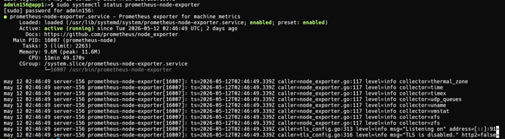

---

## 7. VM Aplicación 2 — Node.js + PM2

**Responsable:** Quispe Anagua Jhon Christian  
**IP:** `192.168.100.157` / `192.168.102.4`

### 7.1 Verificación de Interfaces de Red

```bash
ip addr
```

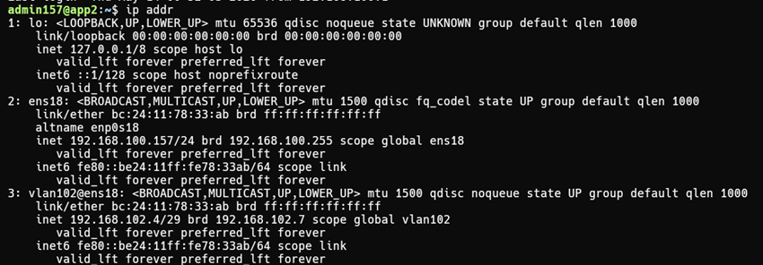

### 7.2 Configuración del Netplan

```bash
sudo nano /etc/netplan/50-cloud-init.yaml
```

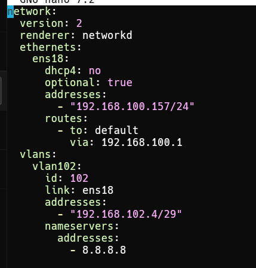

```bash
sudo netplan apply
```

### 7.3 Instalación de Node.js con NVM

```bash
curl -o- https://raw.githubusercontent.com/nvm-sh/nvm/v0.40.3/install.sh | bash
\. "$HOME/.nvm/nvm.sh"
nvm install 22
node -v
npm -v
```

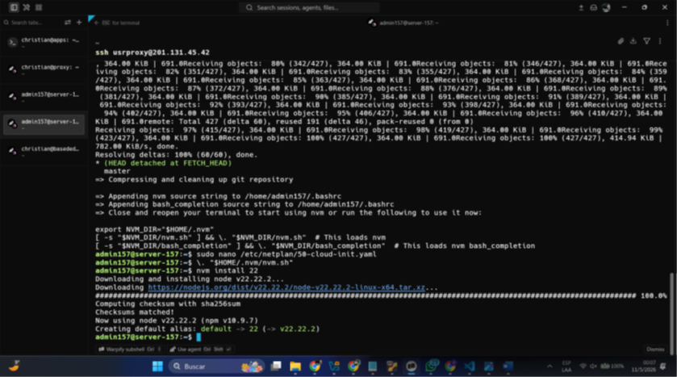

### 7.4 Instalación de PM2

```bash
npm install pm2@latest -g
pm2 --version
```

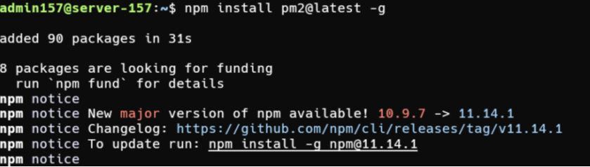

### 7.5 Clonar la Aplicación

```bash
mkdir ~/apps && cd ~/apps
git clone https://github.com/marceloquispeortega/api-restful-crud-movies app
cd ~/apps/app && npm install
```

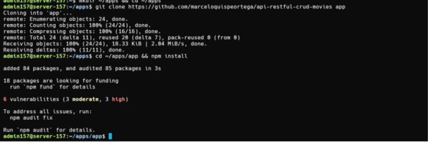

### 7.6 Configurar Variables de Entorno

```bash
cp ~/apps/app/.env.example ~/apps/app/.env
nano ~/apps/app/.env
```

**Contenido del archivo `.env`:**

```env
PORT=3000
DB_HOST=192.168.102.5
DB_PORT=3306
DB_NAME=db_movies
DB_USER=usr_movies
DB_PASSWORD=secret
```

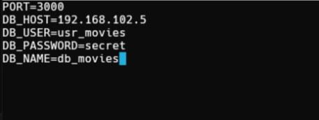

### 7.7 Prueba Manual Antes de PM2

```bash
cd ~/apps/app && node app.js
```

Salida esperada:
```
Servidor ejecutándose en el puerto 3000
Conexión a MariaDB exitosa. Pool creado y probado.
```

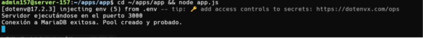

### 7.8 Lanzar con PM2

```bash
cd ~/apps/app && pm2 start app.js --name app2
pm2 status
```

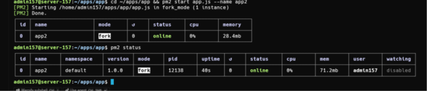

**Configurar auto-arranque:**

```bash
pm2 startup
pm2 save
```

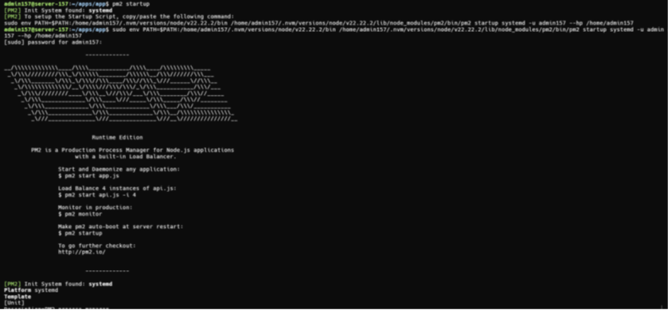

### 7.9 Node Exporter

```bash
sudo apt install prometheus-node-exporter -y
sudo systemctl enable prometheus-node-exporter
sudo systemctl start prometheus-node-exporter
```

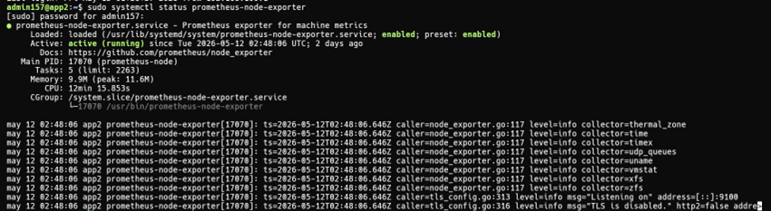

---

## 8. VM Base de Datos — MariaDB

**Responsable:** Chambi Condori Janet  
**IP:** `192.168.100.158` / `192.168.102.5`

### 8.1 Verificación de Interfaces de Red

```bash
ip addr
```

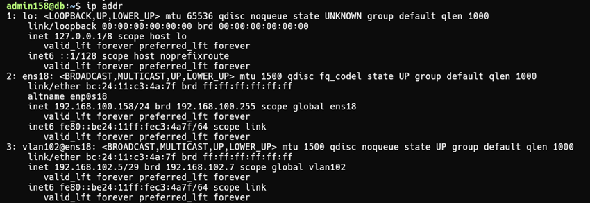

### 8.2 Configuración del Netplan

```bash
sudo nano /etc/netplan/50-cloud-init.yaml
```

**Contenido configurado:**

```yaml
network:
  version: 2
  ethernets:
    ens18:
      addresses:
        - "192.168.100.158/24"
      nameservers:
        addresses:
          - 8.8.8.8
        search: []
      routes:
        - to: "default"
          via: "192.168.100.1"
  vlans:
    vlan102:
      id: 102
      link: ens18
      addresses:
        - "192.168.102.5/29"
```

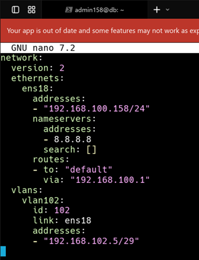

```bash
sudo netplan apply
ping -c 3 192.168.102.1   # Verificar conectividad con el gateway
```

### 8.3 Instalación de MariaDB

```bash
sudo apt update
sudo apt install mariadb-server -y
```

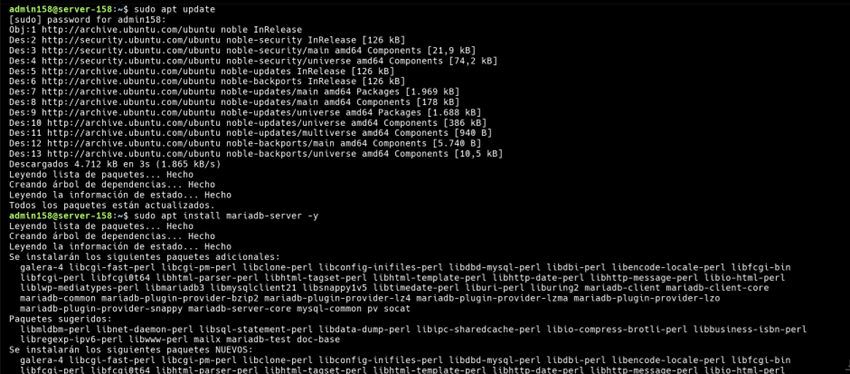

**Verificar estado del servicio:**

```bash
sudo systemctl status mariadb
```

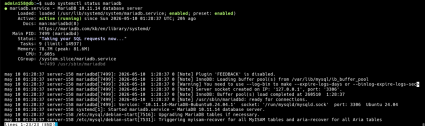

> ⚠️ En este punto MariaDB escucha en `127.0.0.1` (solo local). Esto se cambiará en el paso 8.5.

### 8.4 Hardening con mysql_secure_installation

```bash
sudo mysql_secure_installation
```

| Pregunta | Respuesta |
|---|---|
| Enter current password for root | `[Enter]` (vacío) |
| Switch to unix_socket authentication | `[Enter]` |
| Change the root password? | `[Enter]` → nueva contraseña |
| Remove anonymous users? | `[Enter]` |
| Disallow root login remotely? | `[Enter]` |
| Remove test database? | `[Enter]` |
| Reload privilege tables? | `[Enter]` |

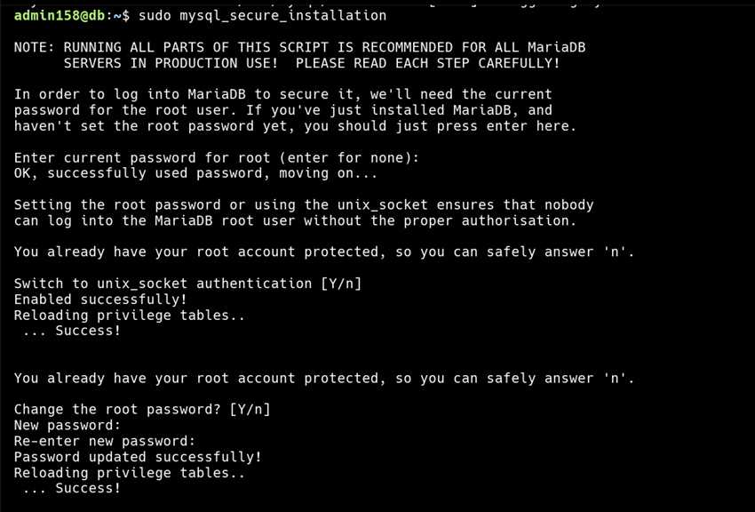

### 8.5 Cambiar el bind-address

Por defecto MariaDB solo acepta conexiones locales. Para permitir conexiones desde las VMs de Apps, se cambia el `bind-address`:

```bash
sudo nano /etc/mysql/mariadb.conf.d/50-server.cnf
```

Cambiar:
```
bind-address = 127.0.0.1
```
Por:
```
bind-address = 192.168.102.5
```

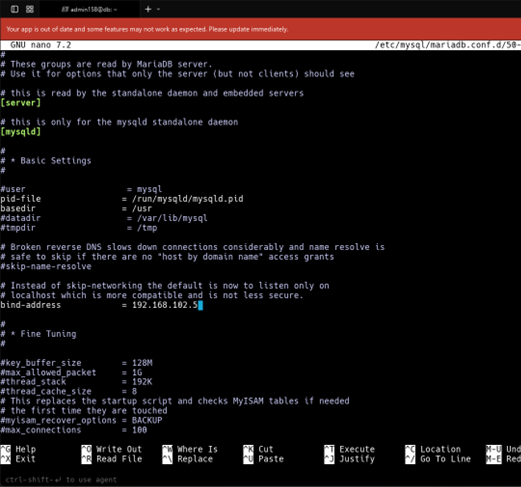

```bash
sudo systemctl restart mariadb
sudo systemctl status mariadb
```

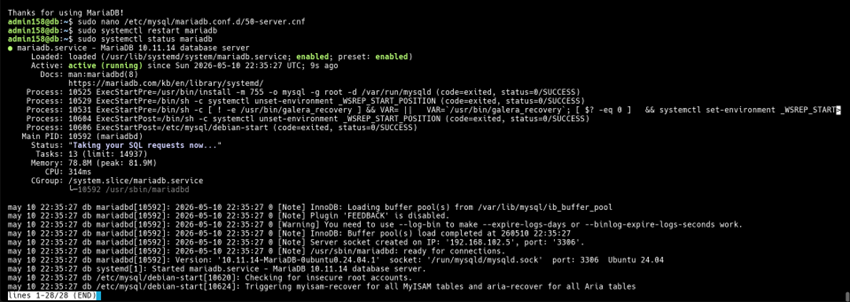

### 8.6 Crear Base de Datos, Usuario y Permisos

```bash
sudo mysql -u root -p
```

```sql
-- Crear la base de datos
CREATE DATABASE db_movies;

-- Crear usuario para App1 (192.168.102.3)
CREATE USER 'usr_movies'@'192.168.102.3' IDENTIFIED BY 'secret';

-- Crear usuario para App2 (192.168.102.4)
CREATE USER 'usr_movies'@'192.168.102.4' IDENTIFIED BY 'secret';

-- Asignar permisos
GRANT ALL PRIVILEGES ON db_movies.* TO 'usr_movies'@'192.168.102.3';
GRANT ALL PRIVILEGES ON db_movies.* TO 'usr_movies'@'192.168.102.4';

-- Aplicar cambios
FLUSH PRIVILEGES;
quit
```

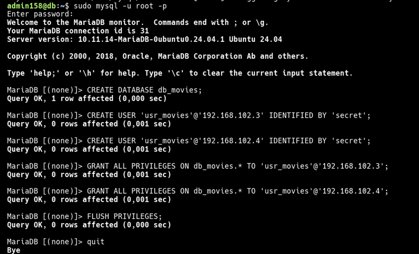

> 💡 Se crean **dos usuarios** con el mismo nombre pero desde IPs diferentes, uno para App1 y otro para App2. Esto es una medida de seguridad: solo las VMs autorizadas pueden conectarse.

### 8.7 Crear Tabla e Insertar Datos

```bash
sudo mysql -u root -p
```

```sql
USE db_movies;

CREATE TABLE movies (
    id serial PRIMARY KEY,
    title character varying(150) NOT NULL,
    year integer,
    UNIQUE(title)
);

INSERT INTO movies (title, year) VALUES
    ('Inception', 2010),
    ('The Matrix', 1999),
    ('Pulp Fiction', 1994),
    ('The Dark Knight', 2008),
    ('Eternal Sunshine of the Spotless Mind', 2004),
    ('Forrest Gump', 1994),
    ('Fight Club', 1999),
    ('The Godfather', 1972),
    ('Interstellar', 2014),
    ('Parasite', 2019);
```

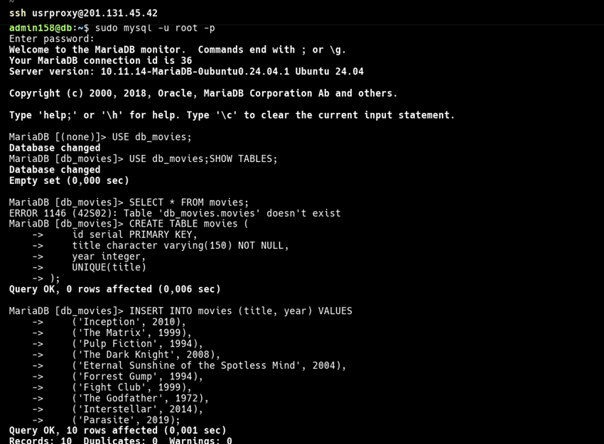

### 8.8 Hardening con UFW

UFW (Uncomplicated Firewall) permite controlar qué conexiones están permitidas. Se configura para que **solo** las VMs de Apps puedan conectarse al puerto 3306 de MariaDB:

```bash
sudo ufw allow from 192.168.102.3 to any port 3306
sudo ufw allow from 192.168.102.4 to any port 3306
sudo ufw enable
sudo ufw status
```

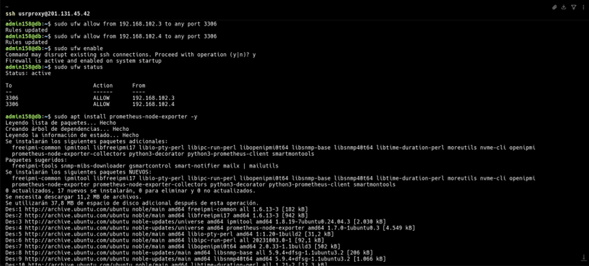

```bash
sudo ufw status numbered
```

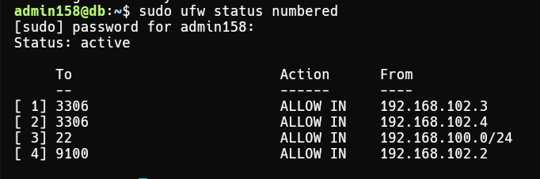

### 8.9 Node Exporter

```bash
sudo apt install prometheus-node-exporter -y
sudo systemctl enable prometheus-node-exporter
sudo systemctl start prometheus-node-exporter

# Verificar que expone métricas
curl http://localhost:9100/metrics
```

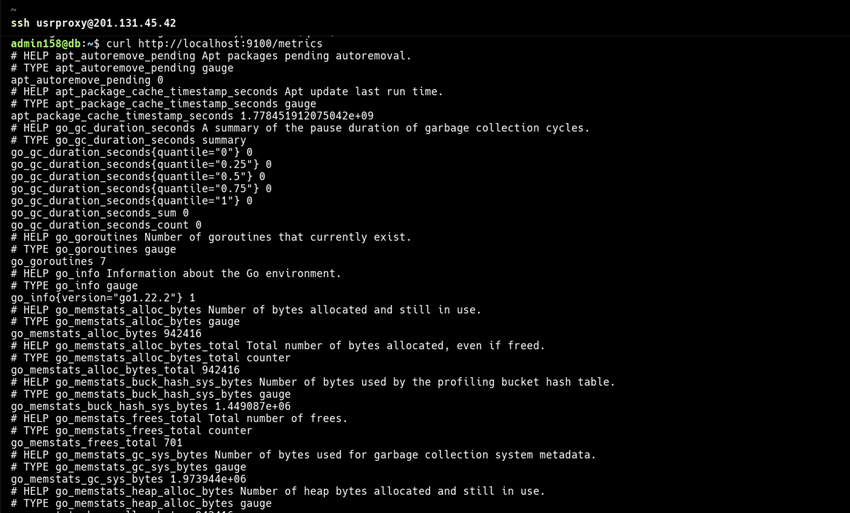

---

## 9. Monitoreo — Prometheus + Grafana

### 9.1 Añadir Prometheus como Data Source en Grafana

Acceder a Grafana desde internet: `https://vlan102-monitoring.rootcode.com.bo`

- Usuario: `admin`
- Contraseña: `admin` (cambiada al primer ingreso)

Ir a **Connections → Data sources → Add data source → Prometheus**

URL del servidor Prometheus: `http://localhost:9090`

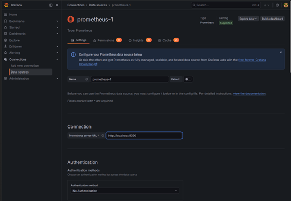

Clic en **Save & test**:

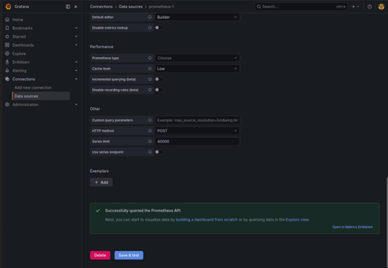

### 9.2 Importar Dashboard Node Exporter Full (ID: 1860)

Ir a **Dashboards → New → Import**

Ingresar el ID `1860` y hacer clic en **Load**:

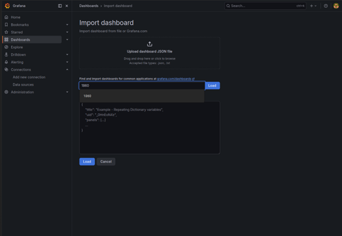

Dashboard importado y visible en la lista:

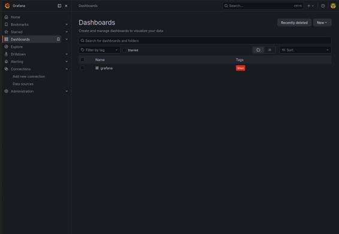

### 9.3 Monitoreo de App1 (server-156)

Dashboard mostrando métricas de la VM App1:
- Job: `node-app1`
- Instance: `192.168.102.3:9100`
- CPU: 0.1%, Memoria: 22.2%, Disco: 60.8%

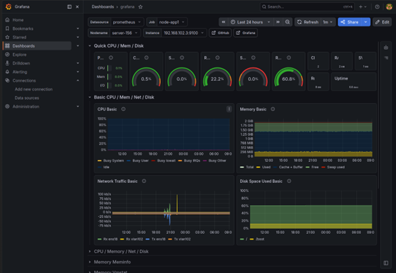

### 9.4 Monitoreo de App2 (app2)

Dashboard mostrando métricas de la VM App2:
- Job: `node-app2`
- Instance: `192.168.102.4:9100`

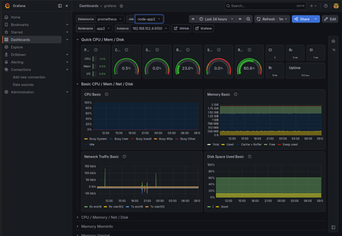

### 9.5 Monitoreo de la Base de Datos (db)

Dashboard mostrando métricas de la VM DB:
- Job: `node-db`
- Instance: `192.168.102.5:9100`
- CPU: 0.4%, Memoria: 22.8%

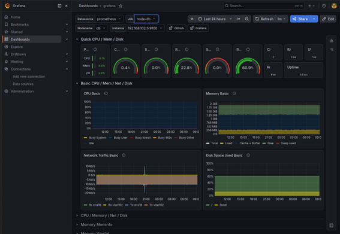

### 9.6 Monitoreo del Proxy (server-155)

Dashboard mostrando métricas de la VM Proxy:
- Job: `node-proxy`
- Instance: `192.168.102.2:9100`
- CPU: 1.1% (mayor por ejecutar Nginx + Prometheus + Grafana), Memoria: 33.6%

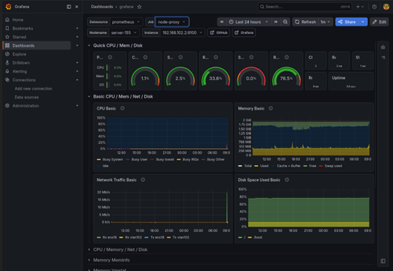

---

## 10. Verificación del Balanceo de Carga

### 10.1 Prueba desde el Proxy

```bash
curl http://192.168.102.2/movies
```

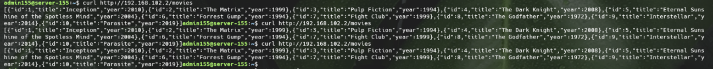

Al ejecutar varias veces el comando `curl`, el proxy alterna entre App1 y App2 (Round Robin):

```
Solicitud 1 → App1 (192.168.102.3) → Hostname: server-156
Solicitud 2 → App2 (192.168.102.4) → Hostname: app2
Solicitud 3 → App1 (192.168.102.3) → Hostname: server-156
...
```

### 10.2 Página Web Interactiva

La aplicación muestra una página web con información del grupo, estado de la base de datos, lista de películas y sección de comentarios:


### 10.3 Failover Automático

Para demostrar el failover, se detiene una de las instancias:

```bash
# En App1:
pm2 stop app1

# Desde el Proxy, varias solicitudes:
curl http://192.168.102.2/movies   # → siempre responde App2
curl http://192.168.102.2/movies   # → siempre responde App2
curl http://192.168.102.2/movies   # → siempre responde App2
```

Nginx detecta automáticamente que App1 no responde y redirige **todo el tráfico a App2**, sin interrupciones para el usuario.

```bash
# Restaurar App1:
pm2 restart app1
# Nginx vuelve a distribuir entre ambas instancias
```

---

## 11. Análisis de Resultados

### 11.1 Comparación de IPs por VM

| VM | IP Admin (SSH) | IP VLAN 102 | Interfaces |
|---|---|---|---|
| Proxy | 192.168.100.155 | 192.168.102.2 | ens18 + vlan102 |
| App1 | 192.168.100.156 | 192.168.102.3 | ens18 + vlan102 |
| App2 | 192.168.100.157 | 192.168.102.4 | ens18 + vlan102 |
| DB | 192.168.100.158 | 192.168.102.5 | ens18 + vlan102 |

### 11.2 Servicios por VM

| Servicio | VM | Puerto | Estado |
|---|---|---|---|
| Nginx (Proxy) | Proxy | 80 | ✅ Activo |
| Node.js App1 | App1 | 3000 | ✅ Activo |
| Node.js App2 | App2 | 3000 | ✅ Activo |
| MariaDB | DB | 3306 | ✅ Activo |
| Prometheus | Proxy | 9090 | ✅ Activo |
| Grafana | Proxy | 3000 | ✅ Activo |
| Node Exporter | Todas | 9100 | ✅ Activo (x4) |

### 11.3 Análisis del Balanceo Round Robin

El algoritmo **Round Robin** distribuye las solicitudes de manera equitativa y predecible. Sus características en este laboratorio fueron:

- **Distribución:** 50% de solicitudes a App1, 50% a App2.
- **Failover:** Cuando App1 fue detenida, Nginx marcó el servidor como "down" tras el primer timeout y dirigió el 100% del tráfico a App2.
- **Recuperación:** Al reiniciar App1, Nginx la reincorporó automáticamente al pool sin intervención manual.
- **Latencia:** Prácticamente nula (~0.3ms) al estar todas las VMs en la misma subred /29.

### 11.4 Observaciones del Monitoreo

| VM | CPU promedio | Memoria usada | Observación |
|---|---|---|---|
| Proxy | 1.1% | 33.6% | Mayor uso por Prometheus + Grafana + Nginx |
| App1 | 0.1% | 22.2% | Node.js en estado idle entre solicitudes |
| App2 | 0.1% | 23.0% | Similar a App1 |
| DB | 0.4% | 22.8% | MariaDB consume más CPU que Node.js |

### 11.5 Ventajas de la Arquitectura Implementada

| Aspecto | Sin HA | Con HA (este laboratorio) |
|---|---|---|
| Caída de App1 | Servicio interrumpido | Tráfico redirigido a App2 automáticamente |
| Escalabilidad | Limitada a 1 servidor | Se pueden agregar más Apps al upstream |
| Observabilidad | Sin métricas | Dashboards en tiempo real con Grafana |
| Seguridad DB | Abierta a cualquier IP | Solo permite conexiones de .3 y .4 |
| Persistencia | Manual | PM2 reinicia apps automáticamente |

---

## 12. Conclusiones

### Quispe Sullca Luis Fernando *(Proxy + Monitoreo)*

Configurar el proxy inverso fue la parte más técnica del laboratorio. Entender la diferencia entre un servidor web convencional y un proxy inverso me ayudó a comprender cómo funcionan en la práctica los balanceadores de carga que usan empresas como Netflix o Amazon. El hecho de que Nginx, con solo 10 líneas de configuración, pueda distribuir tráfico entre múltiples servidores y detectar fallos automáticamente es impresionante. La parte de monitoreo con Prometheus y Grafana me resultó especialmente útil — ver métricas en tiempo real de las 4 VMs desde un solo dashboard es exactamente lo que se usa en ambientes de producción reales.

### Calatayud Mamani Alex Josue *(Aplicación 1)*

Aprender a usar PM2 fue uno de los aprendizajes más prácticos de este laboratorio. En desarrollo normalmente ejecutamos `node app.js` y si cerramos la terminal, la aplicación muere. PM2 resuelve este problema de manera elegante, manteniendo la aplicación viva y reiniciándola automáticamente si falla. Configurar las variables de entorno en el archivo `.env` para separar la configuración del código también fue un aprendizaje importante — es una práctica estándar en desarrollo profesional. El momento en que ejecuté `curl http://192.168.102.2/movies` y vi la respuesta JSON confirmó que todo el stack estaba funcionando correctamente.

### Quispe Anagua Jhon Christian *(Aplicación 2)*

Lo más valioso de este laboratorio fue entender el concepto de **stateless applications** (aplicaciones sin estado). Ambas instancias de la aplicación son idénticas y comparten la misma base de datos, lo que hace posible el balanceo de carga transparente. Si la aplicación guardara estado localmente (en memoria o en disco), el balanceo de carga causaría problemas de consistencia. También aprendí la importancia de la prueba manual antes de usar PM2 — el comando `node app.js` y verificar que dice "Conexión a MariaDB exitosa" te confirma que la configuración del `.env` es correcta antes de delegar la gestión del proceso a PM2.

### Chambi Condori Janet *(Base de Datos)*

Gestionar la base de datos fue más complejo de lo que esperaba, especialmente la parte de seguridad. Entender por qué se cambia el `bind-address` de `127.0.0.1` a la IP de la VLAN, y por qué se crean usuarios con permisos restringidos por IP (`@'192.168.102.3'` en lugar de `@'%'`), me dio una perspectiva real de cómo se aseguran las bases de datos en producción. El `mysql_secure_installation` no es solo un trámite, sino un paso crítico que elimina vulnerabilidades por defecto de MariaDB. Trabajar en un entorno real del centro de datos, con VMs físicas y VLANs reales, fue completamente diferente a trabajar con VirtualBox local — los problemas fueron más reales y las soluciones más significativas.

---

## 13. Anexos

### Anexo A — Archivos de Configuración Completos

#### A.1 Nginx — `/etc/nginx/sites-available/default` (VM Proxy)

```nginx
upstream loadbalancer {
    server 192.168.102.3:3000;   # App 1 — Calatayud Mamani Alex Josue
    server 192.168.102.4:3000;   # App 2 — Quispe Anagua Jhon Christian
}

server {
    listen 80;
    server_name _;

    location / {
        proxy_pass http://loadbalancer;
        proxy_set_header Host $host;
        proxy_set_header X-Real-IP $remote_addr;
        proxy_set_header X-Forwarded-For $proxy_add_x_forwarded_for;
    }
}
```

#### A.2 Prometheus — `/etc/prometheus/prometheus.yml` (VM Proxy)

```yaml
scrape_configs:
  - job_name: 'prometheus'
    static_configs:
      - targets: ['localhost:9090']

  - job_name: 'node-proxy'
    static_configs:
      - targets: ['192.168.102.2:9100']

  - job_name: 'node-app1'
    static_configs:
      - targets: ['192.168.102.3:9100']

  - job_name: 'node-app2'
    static_configs:
      - targets: ['192.168.102.4:9100']

  - job_name: 'node-db'
    static_configs:
      - targets: ['192.168.102.5:9100']
```

#### A.3 Variables de Entorno App1 — `~/apps/app1/.env`

```env
PORT=3000
DB_HOST=192.168.102.5
DB_PORT=3306
DB_NAME=db_movies
DB_USER=usr_movies
DB_PASSWORD=secret
```

#### A.4 Variables de Entorno App2 — `~/apps/app/.env`

```env
PORT=3000
DB_HOST=192.168.102.5
DB_PORT=3306
DB_NAME=db_movies
DB_USER=usr_movies
DB_PASSWORD=secret
```

#### A.5 MariaDB — Bind Address `/etc/mysql/mariadb.conf.d/50-server.cnf`

```ini
# Solo acepta conexiones desde la IP de la VLAN
bind-address = 192.168.102.5
```

#### A.6 UFW — Reglas de Firewall (VM DB)

```bash
# Puerto 3306 solo para App1 y App2
sudo ufw allow from 192.168.102.3 to any port 3306
sudo ufw allow from 192.168.102.4 to any port 3306

# Puerto 22 para administración SSH
sudo ufw allow from 192.168.100.0/24 to any port 22

# Puerto 9100 para Prometheus (VM Proxy)
sudo ufw allow from 192.168.102.2 to any port 9100
```

### Anexo B — Comandos de Verificación

```bash
# Verificar estado de todos los servicios
sudo systemctl status nginx
sudo systemctl status mariadb
sudo systemctl status prometheus
sudo systemctl status grafana-server
sudo systemctl status prometheus-node-exporter

# Verificar interfaces de red
ip addr
ip route

# Verificar que Nginx distribuye el tráfico
for i in {1..6}; do curl -s http://192.168.102.2/ | grep -o 'Hostname.*'; done

# Verificar métricas de Node Exporter
curl http://localhost:9100/metrics | head -20

# Verificar estado de PM2
pm2 status
pm2 logs --lines 20

# Verificar conexión a MariaDB
mysql -u usr_movies -h 192.168.102.5 -p -e "SELECT COUNT(*) FROM db_movies.movies;"
```

### Anexo C — Flujo del Failover

```
Estado NORMAL:
Proxy → [App1 ✅] [App2 ✅]
  solicitud 1 → App1
  solicitud 2 → App2
  solicitud 3 → App1
  solicitud 4 → App2

Estado FAILOVER (App1 detenida):
Proxy → [App1 ❌] [App2 ✅]
  solicitud 1 → App1 (timeout) → reintento → App2 ✅
  solicitud 2 → App2 ✅  (Nginx marcó App1 como down)
  solicitud 3 → App2 ✅
  solicitud 4 → App2 ✅

Estado RECUPERACIÓN (App1 reiniciada):
Proxy → [App1 ✅] [App2 ✅]
  solicitud 1 → App1 ✅  (Nginx reincorporó App1)
  solicitud 2 → App2 ✅
  ...
```

### Anexo D — Glosario

| Término | Definición |
|---|---|
| **HA (Alta Disponibilidad)** | Arquitectura que minimiza el tiempo de inactividad mediante redundancia |
| **Proxy Inverso** | Servidor que recibe solicitudes de clientes y las reenvía a servidores internos |
| **Round Robin** | Algoritmo de balanceo que distribuye solicitudes secuencialmente entre servidores |
| **Failover** | Transferencia automática a un sistema redundante cuando el principal falla |
| **VLAN** | Red local virtual que segmenta lógicamente una red física |
| **PM2** | Gestor de procesos para Node.js con capacidades de producción |
| **Node Exporter** | Agente de Prometheus que expone métricas del sistema operativo |
| **PromQL** | Lenguaje de consultas de Prometheus para análisis de métricas |
| **Upstream** | Bloque de Nginx que define un grupo de servidores backend |
| **bind-address** | Parámetro de MariaDB que define qué interfaz escucha conexiones |

---

*Informe elaborado por el Grupo 2 — Ingeniería de Sistemas, 5to Semestre*  
*Universidad San Francisco Xavier de Chuquisaca — Mayo 2026*
